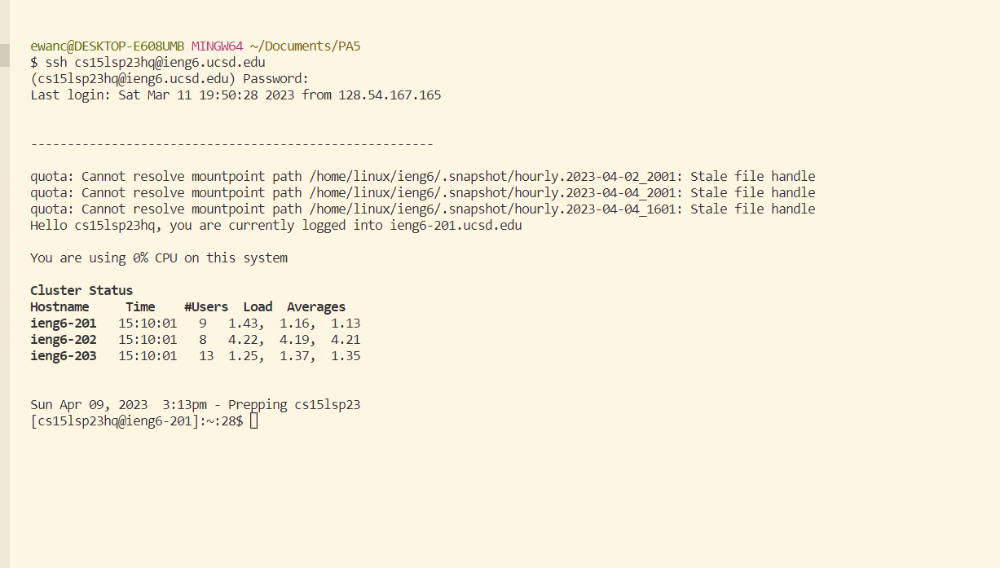

Step 1: Installing VScode
You can download from this link -> https://code.visualstudio.com/
make sure to get a version that is compatible with your device, if you are on Windows you will also need to download git
here is the link for that -> https://gitforwindows.org/
Open up VScode and you are ready to start the next step.
View OpeningVScode.png, this is what you should see.

Step 2: Open the terminal by going to the menu bar on top and clicking terminal -> new terminal. Set the default terminal to use Git Bash by clicking the 
lauch profile drop down arrow and selecting git bash from the list. The arrow is circled below:

Type this line into the terminal "ssh cs15lwi23zz@ieng6.ucsd.edu" but instead of the wi23zz enter the correct characters for your specific account name. 
If the terminal asks you if you want to continue connecting type yes, and then enter your password when promted. The end result should look something like this:

